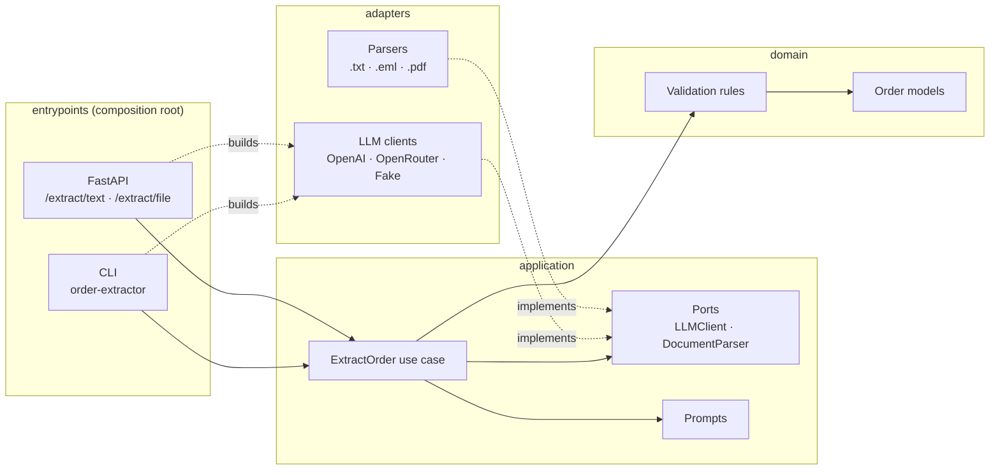

# 🧾 LLM Order Extractor

[](https://github.com/jehanxaibahmed/llm-order-extractor/actions/workflows/ci.yml)     

> Turn unstructured customer emails and PDF orders into validated, structured order JSON using large language models.

## 🎯 Why this project

Businesses still receive many orders as free-text emails and attachments. This project extracts the customer, order lines, quantities and delivery date, then validates them against business rules. It returns clean JSON for any ERP or ordering system.

It **flags problems instead of guessing**. A vague quantity ("a couple of cases"), a delivery date in the past or an email with no order at all comes back as a warning or error that a person can act on. It never comes back as a confident wrong answer.

## ✨ Features

- **Inputs:** plain-text email, `.eml` (with HTML-only bodies and forwarded messages), and text-based PDF
- **Schema-first extraction:** OpenAI structured outputs (strict JSON schema), with a JSON-in-prompt fallback for other models
- **Any model:** OpenAI directly, or any model on OpenRouter, chosen by environment variables
- **Validation report:** errors (no lines, missing quantity) and warnings (estimated or very large quantity, past or far-off delivery date, missing customer, duplicate lines)
- **Relative dates resolved:** "Tuesday please" becomes `2026-10-06`, given a reference `today`
- **REST API with Swagger UI**, plus a scriptable CLI
- **Evaluation harness** that scores the extractor against a synthetic ground-truth set
- **Tests that never need an API key:** 194 tests on a fake LLM, run in CI on Python 3.11–3.14

## 🚀 Quick start

```bash
git clone https://github.com/jehanxaibahmed/llm-order-extractor.git
cd llm-order-extractor
python3.11 -m venv .venv && source .venv/bin/activate
pip install -e ".[dev]"

cp .env.example .env        # then add OPENAI_API_KEY (or OPENROUTER_API_KEY + LLM_PROVIDER=openrouter)
```

**API**, with Swagger UI at http://localhost:8000/docs:

```bash
uvicorn order_extractor.entrypoints.api:app --reload

curl -s localhost:8000/extract/text -H 'content-type: application/json' \
  -d '{"text": "2 boxes of red peppers and a tray of basil for Tuesday please. Riverside Bistro", "today": "2026-10-01"}'

curl -s localhost:8000/extract/file -F file=@samples/pdfs/10_purchase_order.pdf -F today=2026-10-01
```

**CLI**: JSON goes to stdout, a readable summary to stderr. Exit code 0 means a valid order, 1 an invalid order, 2 a failed run.

```bash
order-extractor samples/emails/05_po_in_subject.eml --today 2026-10-01
order-extractor order.pdf --provider openrouter --model openai/gpt-4o-mini --quiet | jq .order
```

**Tests and evaluation**:

```bash
pytest                                  # no API key needed
python -m scripts.evaluate --dry-run    # check the eval harness, no key needed
python -m scripts.evaluate              # real run against the sample set (uses your key)
```

## 📨 Example

Input: [`samples/emails/05_po_in_subject.eml`](samples/emails/05_po_in_subject.eml) (synthetic)

```text
Subject: PO-44871 weekly veg and dairy

Please supply the following for Friday 9 October:

8 cases carrots
5 cases brown onions
600 free-range eggs
12 kg unsalted butter

Deliver to the goods entrance, Harbour Lights Hotel, 12 Quay Street, Porthaven PH1 2AB.
Please quote the PO number on the invoice.
```

Output (`order`, `issues` and `is_valid`; the full result also reports the model, tokens and latency):

```json
{
  "order": {
    "customer_name": "Harbour Lights Hotel",
    "customer_reference": "PO-44871",
    "requested_delivery_date": "2026-10-09",
    "delivery_address": "Goods entrance, Harbour Lights Hotel, 12 Quay Street, Porthaven PH1 2AB",
    "lines": [
      { "product_description": "carrots", "quantity": 8.0, "quantity_text": "8", "quantity_is_estimate": false, "unit": "case", "notes": null },
      { "product_description": "brown onions", "quantity": 5.0, "quantity_text": "5", "quantity_is_estimate": false, "unit": "case", "notes": null },
      { "product_description": "free-range eggs", "quantity": 600.0, "quantity_text": "600", "quantity_is_estimate": false, "unit": null, "notes": null },
      { "product_description": "unsalted butter", "quantity": 12.0, "quantity_text": "12", "quantity_is_estimate": false, "unit": "kg", "notes": null }
    ],
    "notes": "Quote the PO number on the invoice."
  },
  "issues": [
    { "field": "lines[2].quantity", "severity": "warning", "message": "Quantity 600 is above 500." }
  ],
  "is_valid": true
}
```

The PO number comes from the subject line. The 600 eggs are kept, with a warning for a person to confirm. The order is still valid because warnings don't block it; only errors do.

> This output is the sample's ground truth passed through the real validation step, not a live model response. Live results go in the accuracy table below.

## 🏗️ Architecture

The code follows **ports and adapters** (hexagonal architecture), and dependencies only point inwards. The use case sees only the `LLMClient` and `DocumentParser` interfaces, never `openai` or `pypdf`. So providers and file formats can be swapped, or faked in tests, without touching the core. [`tests/test_architecture.py`](tests/test_architecture.py) fails the build if a layer imports one it shouldn't.



| Layer | Folder | Contains |
|---|---|---|
| Domain | [`domain/`](src/order_extractor/domain) | `Order` models, validation rules. No I/O. |
| Application | [`application/`](src/order_extractor/application) | `ExtractOrder` use case, prompts, ports, errors |
| Adapters | [`adapters/`](src/order_extractor/adapters) | OpenAI / OpenRouter / Fake LLM clients (Strategy + Factory), file parsers (Registry by extension) |
| Entrypoints | [`entrypoints/`](src/order_extractor/entrypoints) | FastAPI app, CLI, and the wiring that injects adapters into the use case |

**Request flow:** file → parser → plain text → prompt (with `today`) → LLM (strict JSON schema) → parse into `Order` → validation rules → `ExtractionResult`. A problem with the *content* (bad JSON, schema mismatch, broken business rule) comes back as an issue with HTTP 200. A problem with the *infrastructure* (LLM down, unreadable file, missing key) raises an exception, which becomes 502, 400 or 503.

## 📊 Accuracy

Evaluated on 11 synthetic samples ([`samples/`](samples/README.md)): 9 emails and 2 PDFs, covering bulleted and paragraph orders, relative dates, a PO in the subject, a forwarded email with a disclaimer, chit-chat, vague quantities, an email with no order, and a two-page PDF. Each sample is scored on up to 22 checks: customer, reference, delivery date, line count, each line's description, quantity and unit, the expected warnings and errors, and validity.

| Model | Accuracy | Avg latency | Cost (11 samples) |
|---|---:|---:|---:|
| _pending first live run_ | – | – | – |

> 🚧 **Results pending.** No live model run has been done yet. Run `python -m scripts.evaluate`, which writes `eval_results.md`, to fill this in. The harness itself is verified in CI with `--dry-run`, which replays the ground truth and must score 164/164.

## ⚙️ Configuration

| Variable | Default | |
|---|---|---|
| `LLM_PROVIDER` | `openai` | `openai` or `openrouter` |
| `LLM_MODEL` | `gpt-4o-mini` | any model the provider offers |
| `OPENAI_API_KEY` / `OPENROUTER_API_KEY` | none | key for the selected provider |
| `LLM_TIMEOUT_SECONDS` | `30` | per request |
| `LLM_MAX_RETRIES` | `2` | with exponential backoff, handled by the OpenAI SDK |
| `LLM_TEMPERATURE` | `0` | `none` to omit, for models that reject it |
| `LLM_STRUCTURED_OUTPUT` | `true` for OpenAI, `false` for OpenRouter | strict JSON schema vs. schema in the prompt |

## 🗺️ Roadmap

- [x] Email, `.eml` and PDF ingestion: API and CLI
- [x] Schema-first extraction with Pydantic and strict structured outputs
- [x] Validation report with errors and warnings
- [x] Retries and timeouts
- [x] Synthetic sample set with ground truth, and an evaluation harness
- [x] CI on Python 3.11–3.14
- [ ] First live accuracy results
- [ ] OCR for scanned PDFs
- [ ] Model fallback chain (try a cheaper model first, escalate on errors)
- [ ] Product matching against a catalogue, see **semantic-product-matcher**
- [ ] Voice orders, see **voice-to-order**
- [ ] Docker image, auth and CORS for deployment

## 📌 Status

**v0.1.0.** The extraction pipeline, API, CLI, tests and evaluation harness are complete. Live accuracy numbers are next. All sample data is synthetic: every business, person, address and PO number is invented.

---

Built by [Jahanzaib Ahmad](https://github.com/jehanxaibahmed) · Full Stack Engineer · AI & LLM Systems
